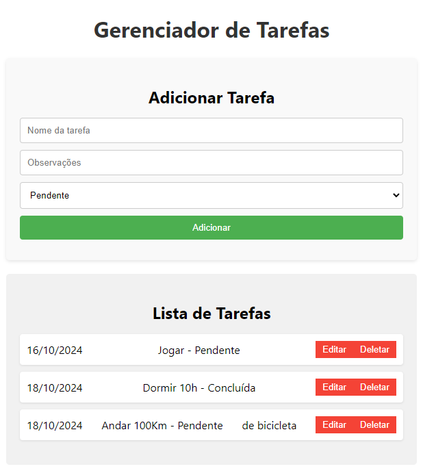
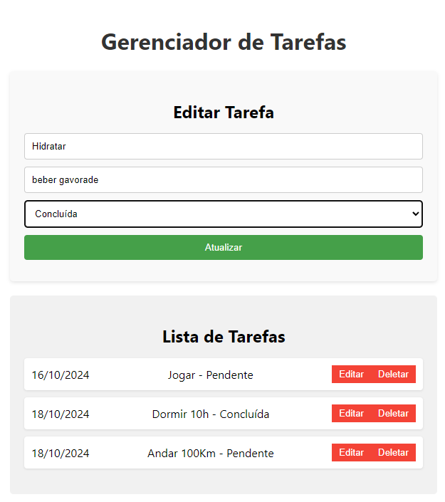

# Desafio-Mediccont-Frontend

> Implementação do frontend de uma To-Do List em React.

## Índice

1. [Introdução](#introdução)
2. [Instalação](#instalação)
3. [Testes](#testes)

---

## Introdução

**Desafio-Mediccont-Frontend** é um aplicativo frontend construído com [React](https://reactjs.org/). Ele oferece uma interface visual para interagir com [Desafio-Mediccont-Backend](https://github.com/KienenManeiro/Desafio-Mediccont-Backend.git) e foi desenvolvido como avaliação parte de um processo seletivo.

### Tecnologias Usadas

- React
- React-dom
- Axios
- Moment

## Instalação

### Pré-requisitos

Antes de começar, certifique-se de ter as seguintes ferramentas instaladas em sua máquina:

- [Node.js](https://nodejs.org/en/) (v14 ou superior)
- [npm](https://www.npmjs.com/)

### Passo a Passo

1. Clone este repositório:

   ```bash
   git clone https://github.com/KienenManeiro/Desafio-Mediccont-Frontend.git
   cd diretorio
2. Inicialize o projeto:

   ```bash
   npm start

## Testes   
-Listagem de tarefas com observação(Hover)


-Atualização de uma tarefa   
